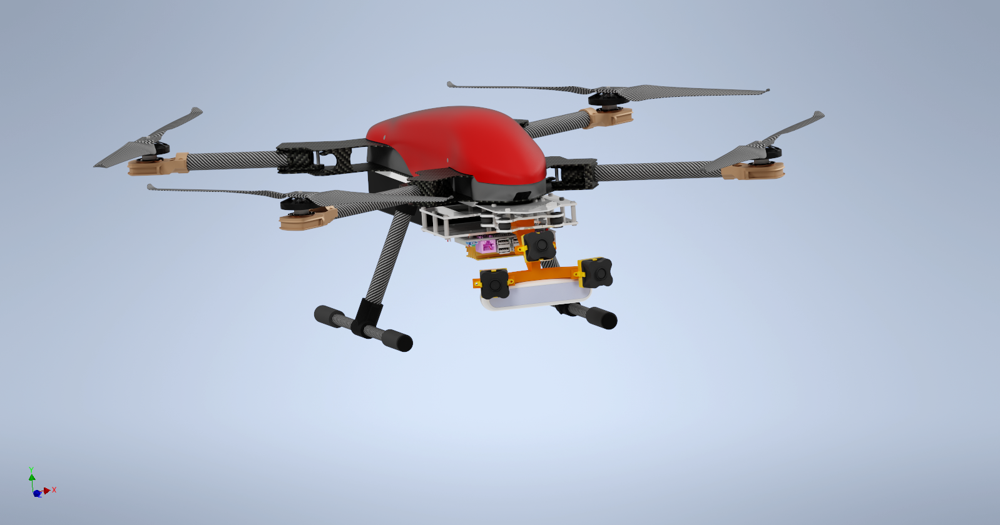
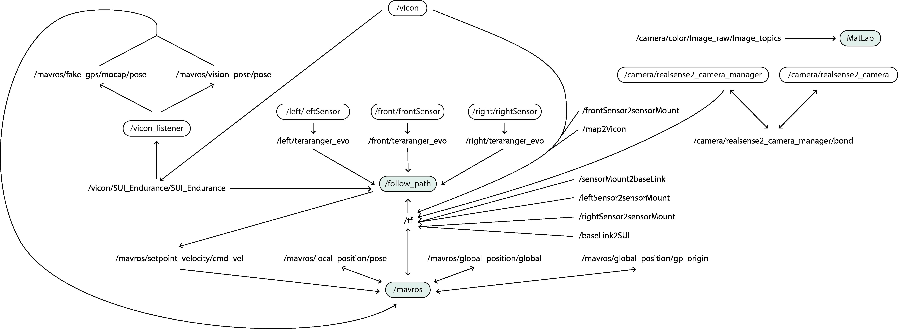

# Autonomous Flight Module ROS
[ROS](http://www.ros.org/) package for autonomous flying of a drone based on local surface estimation.

> **Author**: Marin, Borja  
> **Affiliation**: Heriot-Watt University  

## Description
This development includes a set of methods for autonomous surveying of walls using drones. Testing has been carried out in an indoor environment and, therefore, 3D position and orientation of the drone is captured using VICON cameras. Information about the drone's local environment is acquired using a set of three ranging sensors placed in the nose of the drone.

### Steps followed for autonomy
1. **Retrieve UAV's global position & orientation**: we use [vicon bridge](https://github.com/ethz-asl/vicon_bridge) to capture this information.
2. **Sensor range conversion to 3D point**: transform distances to 3D points using a transformation matrices ([tf2](https://wiki.ros.org/tf2)). These points will be refered to the local reference frame fixed to the drone's body.
3. **Local surface estimation**: a simple plane-fitting function characterises a plane by its normal vector and distance to a reference frame (local frame of the drone).
4. **3D $\rightarrow$ 2D projection**: using the constraint that the drone will be perpendicularly facing the
wall and knowing the parameters of the plane fitted to the local surface, we obtain the 2D projection of the drone’s 3D position.
5. **Control signals calculation**: a set of three PID controllers generate the required velocities to achieve a smooth autonomous flight.
6. **Publish target state**: the target velocities are published to the ROS network.

### ROS Nodes
- **/mavros**: acts as the interface between the aircraft and the control command.
- **/vicon**: publishes the drone’s global position and orientation. Since the drone cannot operate autonomously unless it has data for its global position, Vicon’s data is republished to mavros’ 
 `vision_pose/pose` and `/fake_gps/mocap/pose` topics through a parrot-like node (`vicon_listener`).
- **/follow_path**: his node gathers all the data from the ranging sensors and drone state by subscribing to the respective topics, does the necessary projections and transformations from 3D space to 2D, executes the control sequences for every degree of freedom of the drone and generates the new velocity targets in order to track the trajectory provided by the user. These commands are published to mavros’ `/setpoint_velocity/cmd_vel` and sent to the onboard control unit.

## Key features of package
- 2D position control of drone
- Plane fitting to local surface
- 2D path reconstruction in 3D space
- Linear $(v_x,v_y,v_z)$ and rotational $(\theta_z)$ velocities generation

## Hardware used for testing
- [VICON Vero](https://www.vicon.com/hardware/cameras/vero/) positioning cameras
- [Nvidia Jetson Nano](https://developer.nvidia.com/embedded/learn/get-started-jetson-nano-devkit) Developer Kit
- [Pixhawk Cube Black](https://ardupilot.org/copter/docs/common-thecube-overview.html)
- [Teraranger Evo 3m](https://www.terabee.com/shop/lidar-tof-range-finders/teraranger-evo-3m/)
- [SUI Endurance](https://www.hiteccs.com/drones/products) drone

## Instructions
Packages like [MAVROS](https://github.com/mavlink/mavros), [vicon_bridge](https://github.com/ethz-asl/vicon_bridge), [tf2](https://wiki.ros.org/tf2), [serial](https://github.com/wjwwood/serial), [teraranger](https://github.com/Terabee/teraranger?tab=readme-ov-file) and [teraranger_array](https://github.com/Terabee/teraranger_array) are assumed to be installed.

### New Package
1. Create a ROS Package (instructions [here](https://wiki.ros.org/ROS/Tutorials/CreatingPackage))
2. Move folders `launch` & `scripts` to the new package's folder
3. Modify `follow_path.launch` to suit your needs (*i.e.* change the name of the package in line 27 to the one you just created `<package_name>`)
4. Build package

### Running the module
1. Start ROS `roscore`
2. Launch MAVROS `roslaunch mavros apm.launch` (if Pixhawk is not running Ardupilot firmware, make sure to use the corresponding launch file)
3. Adjust signal rates `rosrun mavros mavsys rate --all 10`
4. Send positioning data to drone `rosrun <package_name> vicon2drone.py`
5. Launch autonomous flying module `roslaunch <package_name> follow_path.launch`

## Citing
If you find this work useful, please consider giving a star :star: and citation (paper is in the works) :t-rex:
